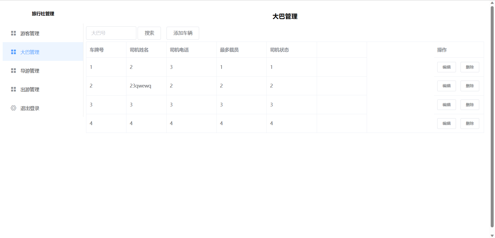

# TravelAgencyManagement
### 旅行社管理系统

后端接口思维导图

登陆界面

注册界面

游客管理

添加游客

编辑游客

大巴管理

##### 说明
- 课堂小练习
- SpringBoot全栈项目
- 使用Sa-Token实现后台登录鉴权
- 使用Knife4j实现接口文档
- 实现旅行社出行管理、导游管理、大巴管理、乘客管理

##### 使用技术
- 后端：Spring、SpringBoot、MyBatis、Mybatis Plus、Lombok、Knife4j、Sa-Token、Hutool
- 前端：Vue2.0、ElementUI、Axios

##### 问题
- 类名和表名定义不规范、不见名知义，后续开发泪两行

##### 本地复现
1. 建立数据库表
2. 使用maven拉取依赖
3. 运行项目

By：tyza66、morsite